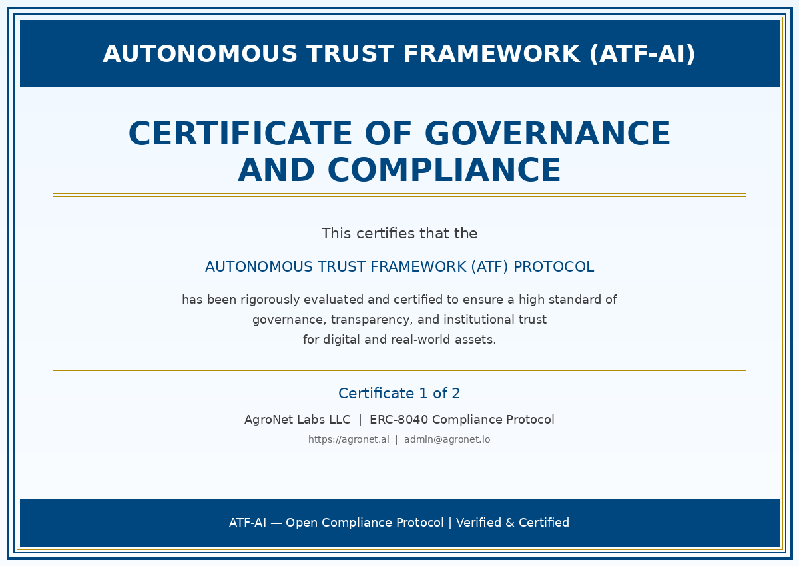

# 🏆 Certificações de Governança e Compliance

O sistema **Autonomous Trust Framework (ATF)** foi rigorosamente avaliado e certificado para garantir um padrão elevado de governança, transparência e confiança institucional para ativos digitais e do mundo real.

---

  

---

  

