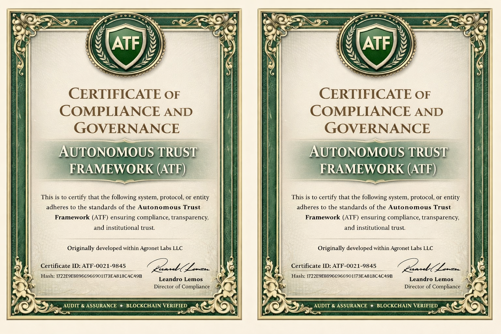
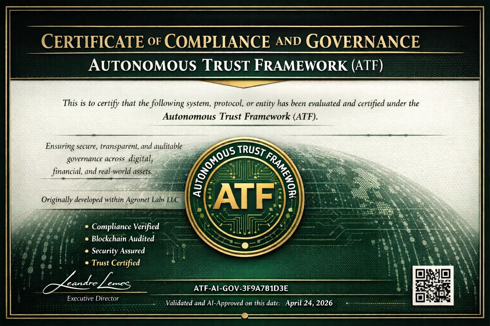

---

# ATF-AI — Autonomous Trust Framework

> **Base-Layer AI Infrastructure & Autonomous Agent Ecosystem.**  
> Built for high-performance, decentralized governance, and institutional-grade digital trust.

**Purpose.** ATF-AI is a sovereign, AI-driven framework designed to coordinate autonomous agents, validate complex workflows, and establish machine-readable compliance layers. 
**Model.** A **free and open architecture** coordinated by **AgroNet Labs**. It operates independently but is fully capable of interacting with and validating public standards like ERC-8040, ISO 20022, and beyond.

---

## 🌍 Vision

ATF-AI establishes an intelligent, decentralized governance layer. We are moving beyond simple smart contracts into **Agent-to-Agent (A2A)** and AI-driven networks, allowing any system, registry, or institution to prove legitimacy, provenance, and operational integrity cryptographically.

> “The wheel already exists.  
> We’re adding the **autonomous navigation, verifiable provenance, and AI governance**.”

---

## 🏦 Institutional & Blockchain Integration

ATF-AI bridges the gap between high-performance Web3 infrastructure (built primarily in Rust/C++) and traditional financial compliance (like SWIFT's ISO 20022).

| Capability | ATF-AI Execution |
|------------|------------------|
| **Autonomous Governance** | Multi-agent coordination (Qwen, GPT, Copilot) with deterministic validation. |
| **Rich Data Messaging** | AI-validated metadata schemas aligned with complex institutional requirements. |
| **Verifiable Provenance** | Cryptographic *in-toto* statements and OTel tracing for every AI action. |
| **Protocol Agnostic** | Capable of supporting ERC-8040 and other sovereign blockchain standards. |

---

## ⚙️ Core Architecture

The ATF-AI protocol operates through a rigorous, high-performance stack:

1. **Agent Layer** — Autonomous AI agents performing logic, synthesis, and code generation.
2. **Governance Layer** — Deterministic validation, cryptographic provenance, and zero-trust verification.  
3. **Execution Layer** — High-speed infrastructure executing validated workflows across decentralized networks.

*Our implementation is continuously extended with state-of-the-art AI validators for semantic, security, and jurisdictional compliance checks.*

---

## 🔗 Ecosystem & Reference Implementations

| Project | Description | Link |
|---------|-------------|------|
| **esg-tokenization-protocol** | Reference implementation in Rust | [github.com/agronetlabs/esg-tokenization-protocol](https://github.com/agronetlabs/esg-tokenization-protocol) |
| **Crates.io Package** | Production-ready Rust crate | [crates.io/crates/esg-tokenization-protocol](https://crates.io/crates/esg-tokenization-protocol) |
| **Documentation** | Live docs on GitHub Pages | [agronetlabs.github.io/atf-ai](https://agronetlabs.github.io/atf-ai/) |

---

## 🔒 Governance & Certifications

- Open, AI-assisted **DAO governance** for validation and certification.  
- Coordinated through **AgroNet Labs**, strictly following the **Autonomous Trust Framework (ATF)**.  

 

    
    
    

 

---

## ⚖️ License

Openly distributed under **MIT License**.  
Implementation and certification trademarks remain under **AgroNet Labs** governance.

---

## 📬 Contact

**AgroNet Labs LLC**  
<https://agronet.ai>  
**E-mail:** admin@agronet.io  
Telegram: @agronetlabs
