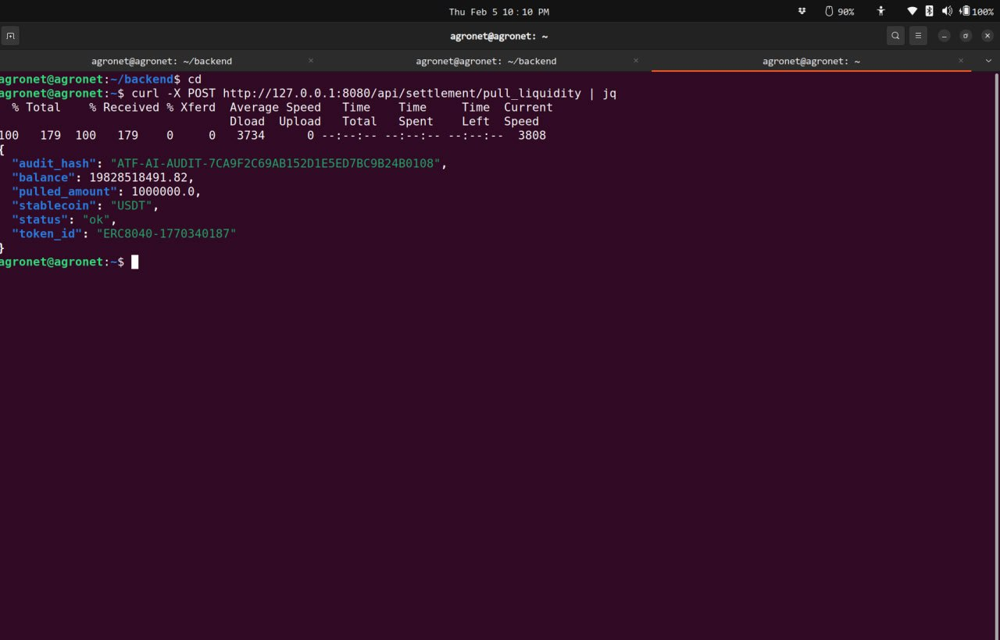
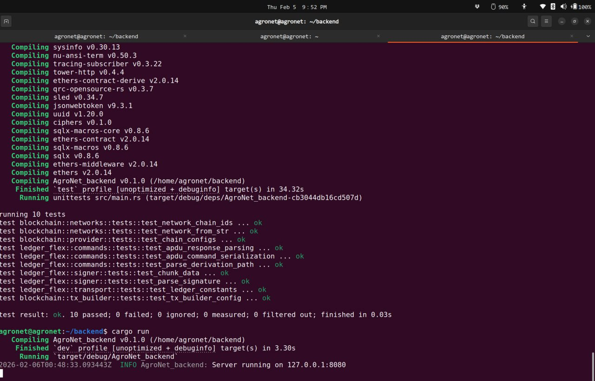

---

# ATF-AI: Autonomous Trust Framework for Artificial Intelligence

> *Verifiable provenance, deterministic governance, and zero-trust validation for any agent, on any infrastructure.*

**Purpose.** ATF-AI is a universal, infrastructure-agnostic framework that answers the question:
> *"How do AI agents prove they are trustworthy, traceable, and auditable regardless of the underlying infrastructure?"*

**Model.** A **free and open protocol** coordinated by **AgroNet Labs**. Blockchain, cloud, IoT, enterprise, and any other execution environment can implement ATF-AI as a trust layer independently, without coupling to any specific technology stack.

---

## Vision

ATF-AI establishes a governance and trust layer for autonomous agents decoupled from any specific infrastructure. Any system that needs to prove the legitimacy, provenance, and operational integrity of AI-driven actions can implement ATF-AI.

> "The wheel already exists.  
> We're adding **autonomous navigation, verifiable provenance, and deterministic governance**."

---

## Core Architecture

The ATF-AI protocol operates through three infrastructure-agnostic layers:

1. **Agent Layer** Autonomous AI agents performing logic, synthesis, validation, and orchestration tasks.
2. **Governance Layer** Deterministic validation, cryptographic provenance, and zero-trust verification of every agent action.
3. **Execution Layer** Protocol-agnostic infrastructure executing validated workflows across any runtime environment.

*Any system "cloud, on-premise, decentralized, or embedded” can implement these three layers using ATF-AI's open specification.*

---

## Core Pillars

| Pillar | Description |
|--------|-------------|
| **Verifiable Provenance** | Every agent action is cryptographically signed and traceable via in-toto attestations and OpenTelemetry traces. |
| **Deterministic Governance** | Validation rules are explicit, reproducible, and auditable no hidden logic, no opaque decisions. |
| **Zero-Trust Validation** | No agent or system is implicitly trusted. Every interaction is verified before execution. |

---

## Integrations & Adapters

ATF-AI is the framework. Specific technology integrations are **optional downstream adapters** not core dependencies.

| Adapter | Description | Link |
|---------|-------------|------|
| **erc-8040-ecosystem** | ATF-AI adapter for blockchain/ESG digital asset workflows | [github.com/agronetlabs/erc-8040-ecosystem](https://github.com/agronetlabs/erc-8040-ecosystem) |
| **Documentation** | Live docs on GitHub Pages | [agronetlabs.github.io/atf-ai](https://agronetlabs.github.io/atf-ai/) |

> Want to build an ATF-AI adapter for your infrastructure (cloud, IoT, health, fintech, agro)? See [CONTRIBUTING.md](./CONTRIBUTING.md).

---

## Governance & Certification

- Open, AI-assisted governance for validation and certification.
- Coordinated through **AgroNet Labs**, strictly following the **Autonomous Trust Framework for Artificial Intelligence (ATF-AI)** specification.
- See [GOVERNANCE.md](./GOVERNANCE.md) for full governance model.

 

    
    
    

 

---

## License

Openly distributed under **MIT License**.  
Implementation and certification trademarks remain under **AgroNet Labs** governance.

---

## Proof of Build

**73 tests passing across 4 languages. Zero failures.**

| Component | Language | Tests | Status |
|-----------|----------|-------|--------|
| ERC-8040 Core | Rust | 31/31 | Passing |
| Python SDK | Python 3.12 | 30/30 | Passing |
| C++ SDK | C++17 | 2/2 | Passing |
| Backend (Settlement) | Rust/Axum | 10/10 | Passing |
| **Total** | | **73/73** | **Zero failures** |

### ATF-AI Audit Hash — Live Settlement

`ATF-AI-AUDIT-{SHA256}` generated automatically on every settlement operation.

### Backend Build All Tests Passing

Clean Rust build, 10/10 unit tests passing, server live.

---

## Contact

**AgroNet Labs LLC**  
<https://agronet.ai>  
**E-mail:** admin@agronet.io  
Telegram: @agronetlabs

