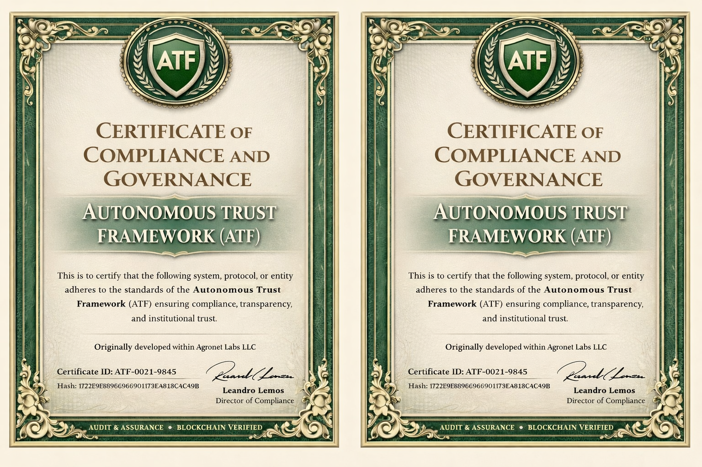
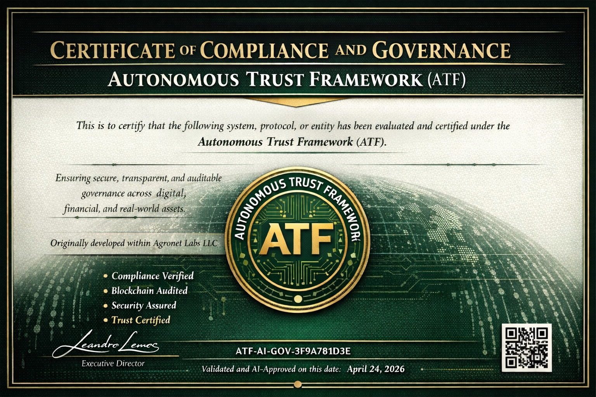
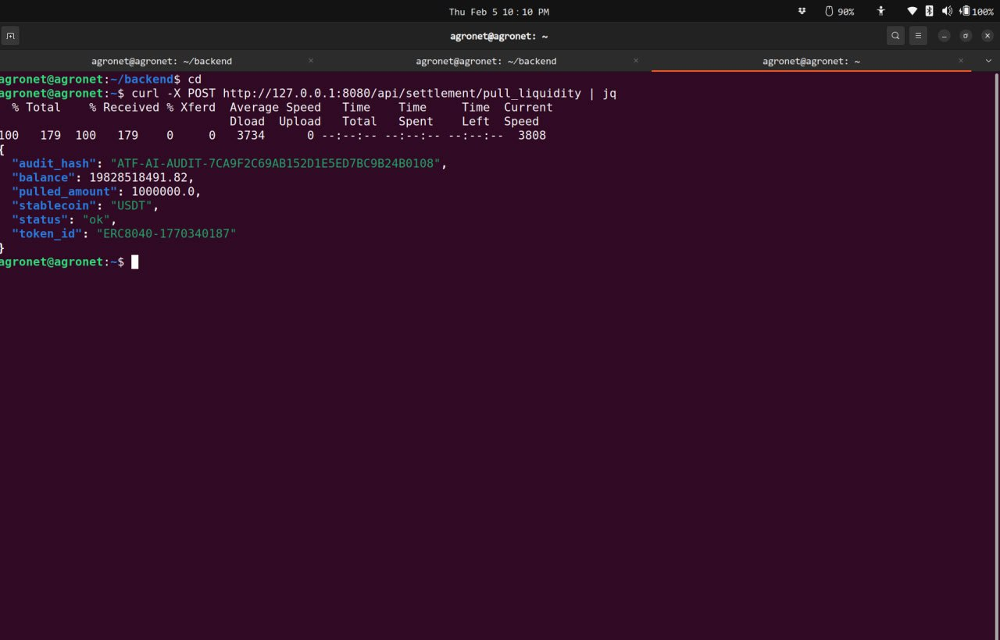
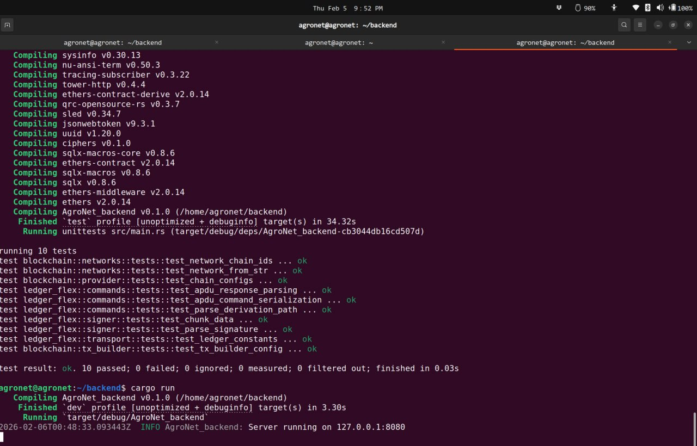

[](./specs/atf-core-v1.md)
[](./specs/adapters/rwa-privileged-governance.md)
[](https://github.com/agronetlabs/ATF-AI/actions)
[](https://github.com/agronetlabs/ATF-AI/actions)
[](./LICENSE)

[](./docs/concepts/provenance.md)
[](./CONTRIBUTING.md)
[](https://github.com/features/copilot)
[](./specs/adapters/erc8040.md)
[](./docs/integrations/blockchain/swift-bridge.md)

---

# ATF-AI: Autonomous Trust Framework for Artificial Intelligence

> *Verifiable provenance, deterministic governance, and zero-trust validation for any agent, on any infrastructure.*

**Purpose.** ATF-AI is a universal, infrastructure-agnostic framework that answers the question:

> *How do autonomous agents and governed machine actions prove they are authorized, traceable, and auditable regardless of the underlying infrastructure?*

**Model.** ATF-AI is a **free and open protocol** coordinated by **AgroNet Labs LLC**. Blockchain, cloud, enterprise, IoT, financial infrastructure, and other execution environments can implement ATF-AI without coupling the core protocol to a specific technology vendor.

**Governance.** ATF-AI is **human-governed and AI-assisted**. AI systems may contribute architecture, code, documentation, tests, and security analysis; final protocol authority remains with the human governance process defined in [`GOVERNANCE.md`](./GOVERNANCE.md).

---

## Vision

ATF-AI establishes a governance and trust layer for autonomous systems decoupled from any specific infrastructure.

> "The wheel already exists.  
> We're adding **autonomous navigation, verifiable provenance, and deterministic governance**."

---

## Core Architecture

ATF-AI operates through three infrastructure-agnostic layers:

1. **Agent Layer** — autonomous agents or governed actors perform logic, synthesis, validation, and orchestration.
2. **Governance Layer** — deterministic policy validates identity, authorization, compliance, provenance, and action eligibility.
3. **Execution Layer** — infrastructure executes only governance-approved workflows and records the outcome.

See [`docs/architecture.md`](./docs/architecture.md).

---

## Core Pillars

| Pillar | Description |
|---|---|
| **Verifiable Provenance** | Governed actions carry traceable evidence and integrity metadata. |
| **Deterministic Governance** | Rules are explicit, version-controlled, reproducible, and auditable. |
| **Zero-Trust Validation** | No agent, signer, credential, or system is implicitly trusted. |
| **Governance / Execution Separation** | Technical signing capability does not automatically create governance authority. |

---

## Integrations & Adapters

ATF-AI is the framework. Infrastructure- and domain-specific integrations are adapters, not core dependencies.

| Adapter | Description | Status | Link |
|---|---|---|---|
| **ERC-8040** | Blockchain / ESG digital-asset workflow adapter | DRAFT v0.1 | [`spec`](./specs/adapters/erc8040.md) · [implementation ecosystem](https://github.com/agronetlabs/erc-8040-ecosystem) |
| **RWA Privileged Action Governance** | Governance for admin actions, redemption, signer changes, oracle/compliance changes, upgrades, and settlement authorization | DRAFT v0.1 | [`spec`](./specs/adapters/rwa-privileged-governance.md) · [`guide`](./docs/integrations/blockchain/rwa-privileged-governance.md) |

> Want to build an ATF-AI adapter? See [`CONTRIBUTING.md`](./CONTRIBUTING.md).

---

## RWA Privileged Governance Principle

For institutional digital assets, ATF-AI separates **governance authorization** from **cryptographic execution**:

```text
Action Intent
    -> ATF-AI Policy Validation
    -> Governance Attestation
    -> MPC / Multisig / HSM / Institutional Signer
    -> Blockchain / Custodian / Settlement Rail
    -> Execution Receipt + Provenance
```

A valid administrator key, signer credential, MPC share, or HSM capability is therefore an **execution capability — not, by itself, sufficient governance authority** for a high-impact RWA action.

The first reference implementation includes deterministic checks for quorum, required roles, distinct approvers, provenance, compliance attestations, timelocks, and active-redemption protections.

---

## Governance & Certification

- ATF-AI uses **open protocol development with coordinated human stewardship**.
- AgroNet Labs coordinates core versioning, adapter recognition, and formal certification decisions.
- AI tools and models are non-authoritative contributors.
- **Conformance is not the same as certification.** Formal `ATF-AI Certified` status requires an explicit governance decision.
- Adapter maturity is explicit; a passing build does not automatically promote a `DRAFT` adapter to `STABLE`.

See [`GOVERNANCE.md`](./GOVERNANCE.md) and [`CONTRIBUTING.md`](./CONTRIBUTING.md).

<br>
<div align="center">
    
  <br><br>
    
</div>
<br>

---

## AI-Assisted Development

AI participation is disclosed as contribution metadata rather than protocol authority.

As of **2026-08-23**, the OpenAI model used in the current ATF-AI architecture/governance review is **GPT-5.6 Sol**. GitHub Copilot and other AI tools may also assist development.

ATF-AI does **not** depend on GPT-5.6 Sol, OpenAI, GitHub Copilot, or any specific model/vendor. See the attribution and review policy in [`CONTRIBUTING.md`](./CONTRIBUTING.md).

---

## Build & Validation Evidence

### Current repository CI — 2026-08-23

The current ATF-AI repository CI validates the RWA-enhanced Rust core and both canonical JSON Schemas:

| Check | Result |
|---|---:|
| Rust unit tests | **31/31 passing** |
| Rust integration tests | **6/6 passing** |
| **Current Rust total** | **37/37 passing** |
| `ERC-8040-atf.schema.json` | **valid** |
| `atf-rwa-privileged-action.schema.json` | **valid** |

### Extended ecosystem snapshot — 2026-05-18

A prior proof-of-build snapshot recorded **81/81 passing tests** across the broader ERC-8040 Rust/Python/C++ and settlement/backend components at that point in time. Since the RWA governance module adds new Rust tests, that historical total is retained as a dated snapshot rather than presented as the current repository total.

See [`PROOF_OF_BUILD.md`](./PROOF_OF_BUILD.md) for the dated evidence and distinction between current CI and historical ecosystem results.

### ATF-AI Audit Hash — Settlement Evidence



`ATF-AI-AUDIT-{SHA256}` is generated by the referenced settlement implementation as documented in the proof-of-build snapshot.

### Backend Build Evidence



---

## Security

Security-sensitive contributions must follow [`SECURITY.md`](./SECURITY.md). Production private keys, seed phrases, MPC shares, HSM secrets, and sensitive signing credentials must never be committed to this repository.

---

## License

Repository content is distributed under the [`MIT License`](./LICENSE). Package-level metadata may declare additional compatible licensing where explicitly stated by that package.

---

## Contact

**AgroNet Labs LLC**  
<https://agronet.ai>  
**E-mail:** admin@agronet.io  
Telegram: @agronetlabs
